# TeleGrad 
## Telegram bot to monitor and control deep learning experiments
 
 
Deep learning training processes can run for many hours/days, and you are not always near your station to see how it's progressing or to make adjustments.
Using this Telegram bot you can seamlessly get constant updates and even control your training process, all through your phone.

Works with TensorFlow & Keras (with Keras, all you need is to include a dedicated callback).
Should also be good for Pytorch though I did not try. PRs are welcome!

### Features
- Get per epoch updates on the loss, accuracy etc.
- Change the learning rate
- Get loss convergence plots
- Kill the training process
- Query the latest LR or metrics
- Limit access to a specific Telegram user id

<br><br>
To start interacting with the bot, send `/start`.  At any time you can send `/help` to see all available commands.

##### Automatic Epoch Updates:
Once you send `/start` from your Telegram app, the bot will send you updates every epoch:

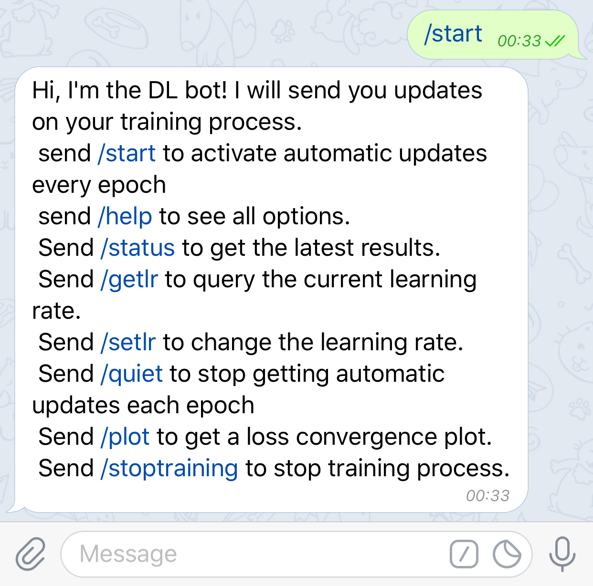  <br>
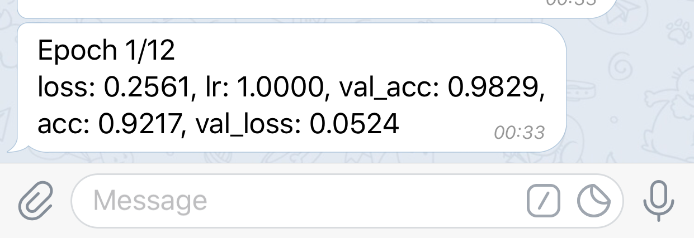


You can stop getting these automatic updates by sending `/quiet`:  
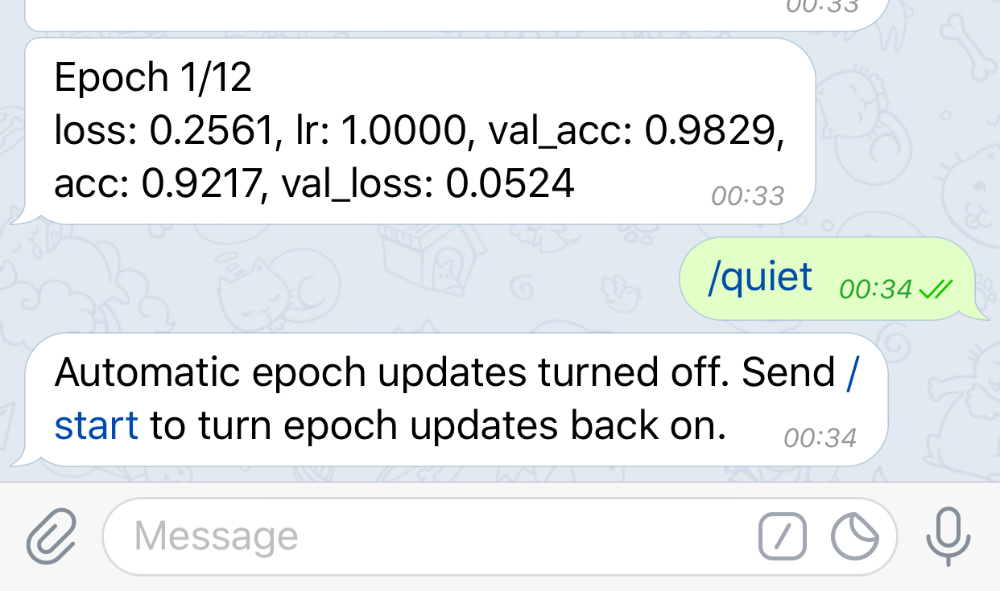

To turn updates back on, send `/start` again.  
At any time (even on quiet mode), send `/status` to get the update of the latest epoch:  
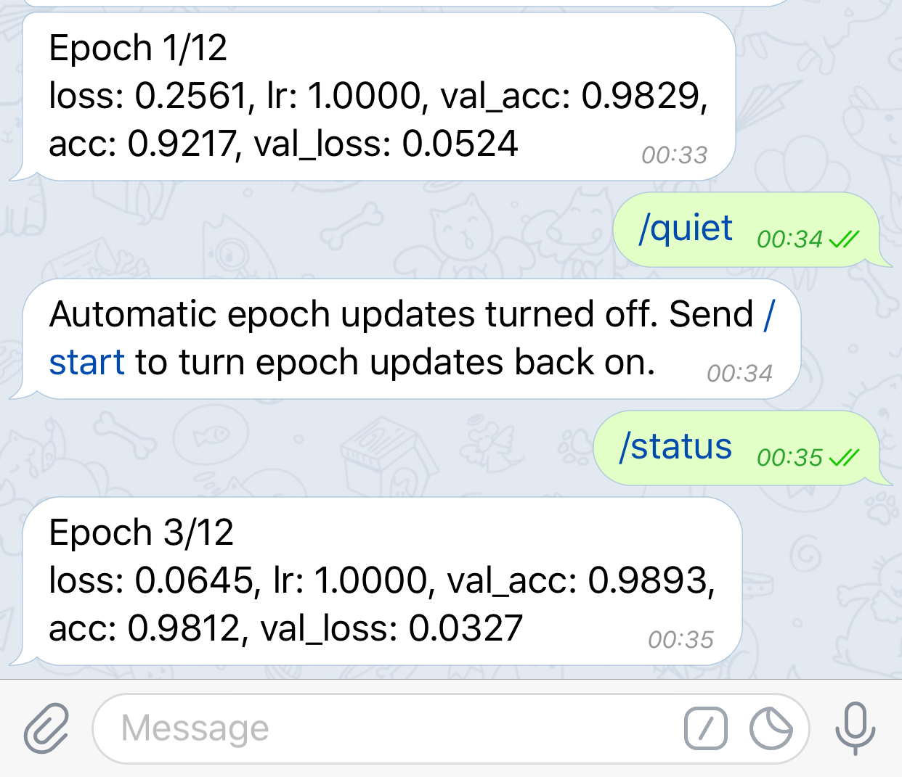

##### Modifying the learning rate:
If your model's convergence plateaus, and you want to change the learning rate of your optimizer, simply send `/setlr`:  
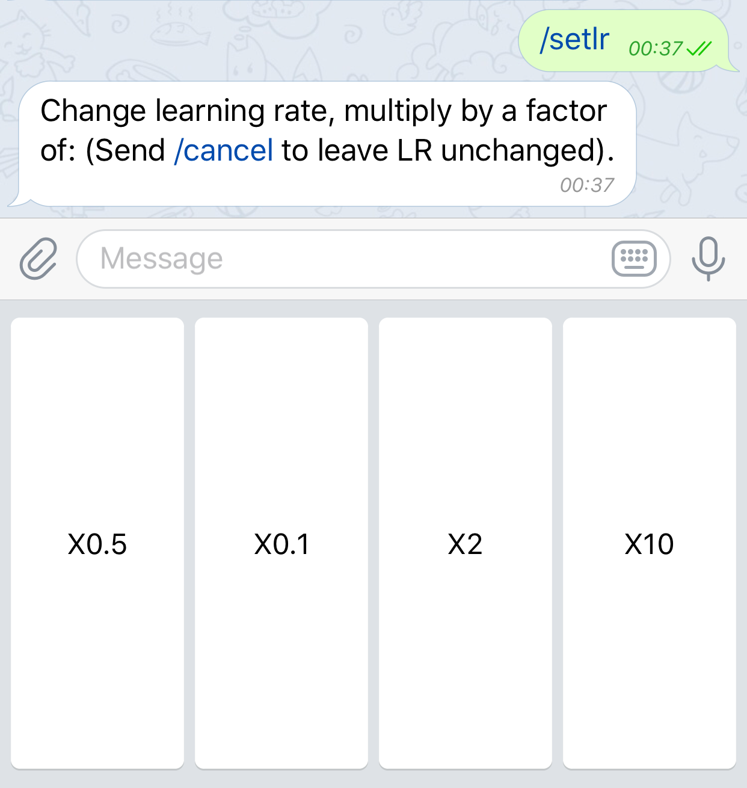<br>
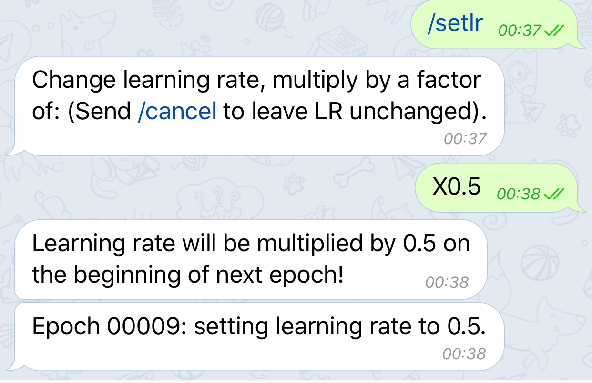

You can also query the current learning rate any time by sending `\getlr`:  
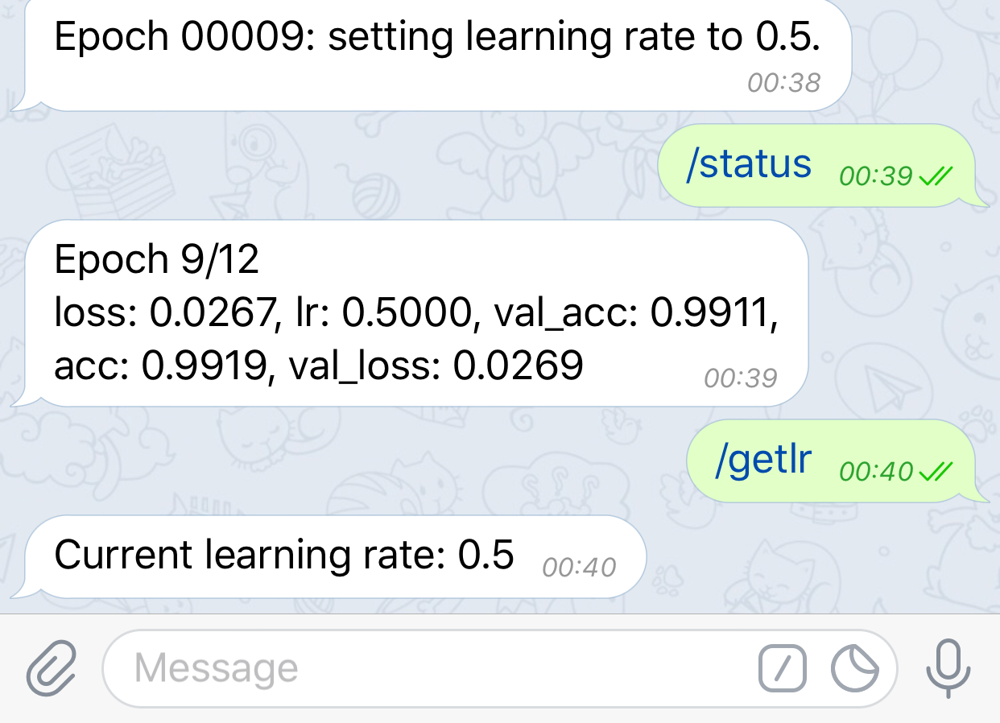

##### Plotting convergence graphs
To get a convergence plot of the loss, send `/plot` from the app:  
 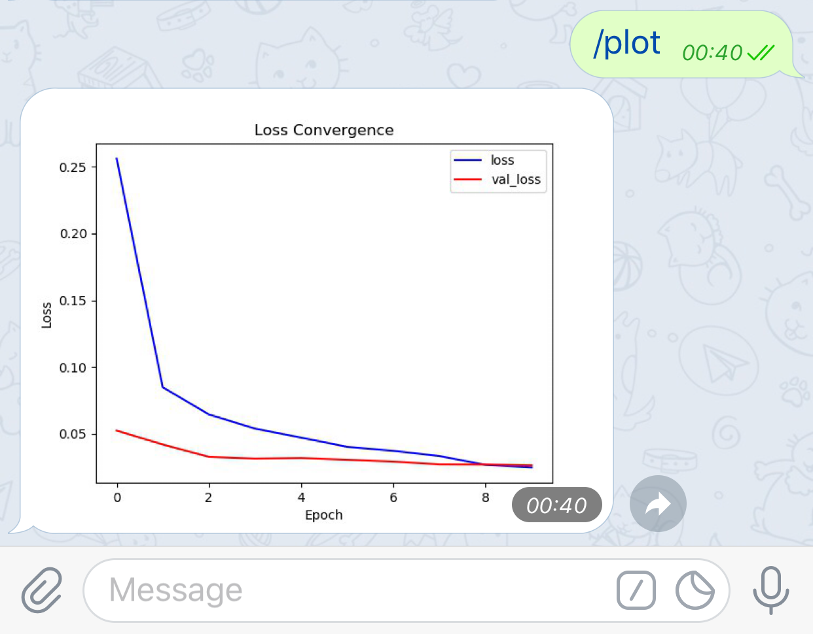

##### Stop training process
If you want, you can stop your training process from the app. Just send `/stoptraining` and click on the Yes button.
With the Keras callback, training is stopped safely. Other operations that needed to happen after training will still take place:
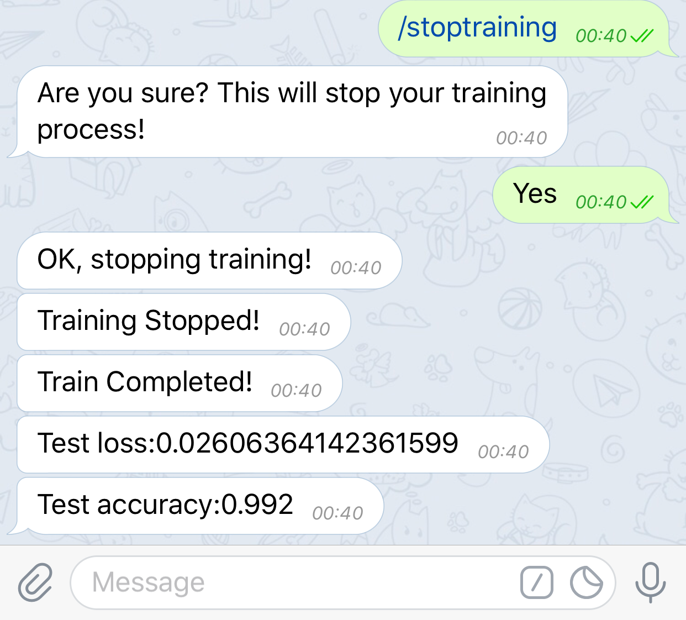

 
### Dependencies
   - [python-telegram-bot](https://github.com/python-telegram-bot/python-telegram-bot)
   - Keras (optional, if you want to use the Keras callback)
   - matplotlib (optional, to send convergence plots )  
     
     
   Tested in the following environment:
   - Python 3.5
   - Tensorflow 1.11
   - Keras 2.2.4
   - Windows OS
   
### Installation
1. Install [python-telegram-bot](https://github.com/python-telegram-bot/python-telegram-bot):  
    `$ pip install python-telegram-bot --upgrade`
2. Clone this repository

3. Add `dl_bot.py` to your project

4. Add `telegram_bot_callback.py` to your project (optional, only if you use Keras)

### Usage
First, create a Telegram bot using the Telegram app.
It is very simple, just follow the steps in the dedicated section below.
Once you have created your bot, search for it and start a conversation with it on the Telegram app.

You can supply a `user_id` to restrict interaction with your bot only to a specific user. This is highly recommended.
(Instructions on how to find your user id are provided below)

You can either use the Keras callback to automatically interact with the bot, or to customize the interactions yourself.  
__Note that the bot will start sending messages only after you send it the `/start` message from the app.__

#### Keras Callback
The following block is all you need in order to use the Keras Telegram bot callback:
```python
# Telegram Bot imports
from dl_bot import DLBot
from telegram_bot_callback import TelegramBotCallback

telegram_token = "TOKEN"  # replace TOKEN with your bot's token

#  user id is optional, however highly recommended as it limits the access to you alone.
telegram_user_id = None  # replace None with your telegram user id (integer):

# Create a DLBot instance
bot = DLBot(token=telegram_token, user_id=telegram_user_id)
# Create a TelegramBotCallback instance
telegram_callback = TelegramBotCallback(bot)
```
Just add `telegram_callback` to the list of callbacks passed to model.fit:
```python
model.fit(x_train, y_train,
          batch_size=batch_size,
          epochs=epochs,
          verbose=1,
          validation_data=(x_test, y_test),
          callbacks=[telegram_callback])
```
That's all, you are good to go!

__An example usage is included in `keras_mnist_example.py`__
#### Custom messages
If you are using TensorFlow (or using Keras and want to customize interactions with the bot). Start by including the following code in your script:
```python
# Telegram Bot imports
from dl_bot import DLBot

telegram_token = "TOKEN"  # replace TOKEN with your bot's token

# user id is optional, however highly recommended as it limits the access to you alone.
telegram_user_id = None   # replace None with your telegram user id (integer):

# Create a DLBot instance
bot = DLBot(token=telegram_token, user_id=telegram_user_id)
# Activate the bot
bot.activate_bot()
```
Then you will need to implement responses for the `/setlr`, `/getlr`, `/status`, `/stoptraining`,`/quiet` messages.  
Also, you will need to send the bot the loss values each epoch in order to use the `/plot` command.  
It is fairly easy to include these responses, a full example is included in `tf_mnist_example.py`   
### Examples
Implementation examples are included for both Keras and TensorFlow in `keras_mnist_example.py` and `tf_mnist_example.py`.
Both examples include all bot functions over the official keras/tf MNIST examples. 


##### Creating a Telegram bot
To create a Telegram bot using the Telegram app, follow these steps:
1. Open the Telegram app
2. Search for the BotFather user (@botfather):
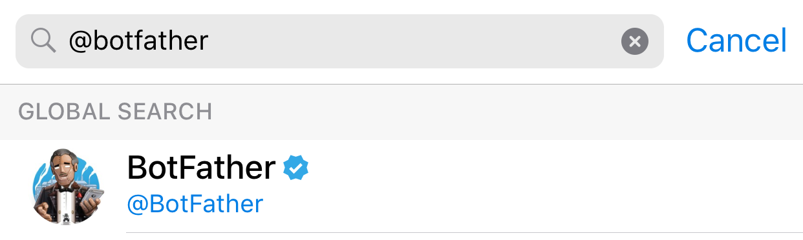
3. Start a conversation with BotFather and click on `start`

4. Send /newbot and follow instructions on screen:
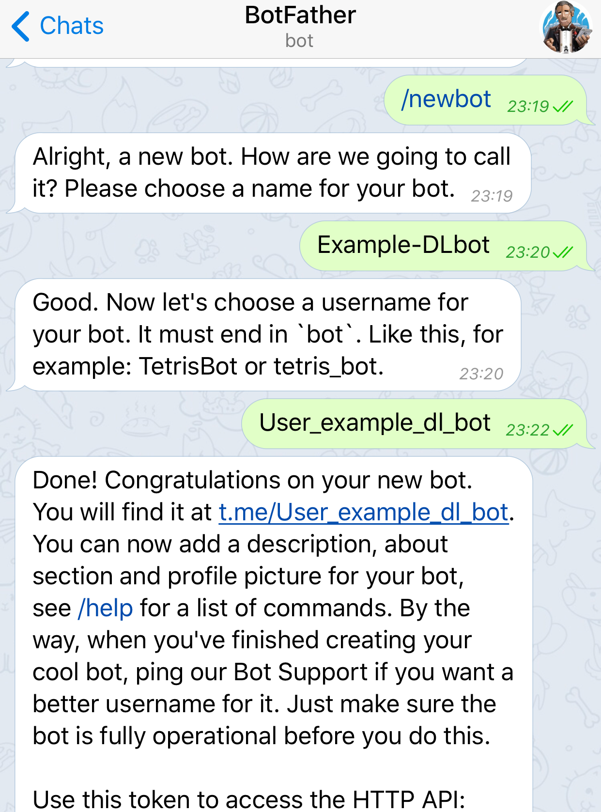
5. Copy the bot token, you will need it when using the DL-Bot:  
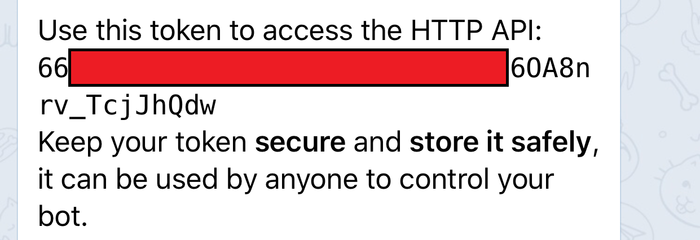

##### Finding your Telegram user id:
1. Open the Telegram app
2. Search for the userinfobot user (@userinfobot):

3. Start a conversation with the bot and get your user id

### References
  - [Telegram bots documentation](https://core.telegram.org/bots)
    

##### For more projects visit: https://eyalzk.github.io
